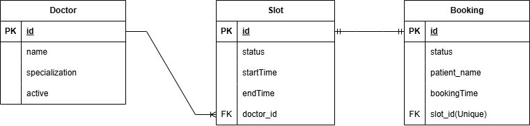

# 🏥 Appointment Scheduling API

## 📌 Description

A RESTful API built with Spring Boot for managing doctor appointment scheduling.

The system allows administrators to create doctors and assign available appointment slots to them. Patients can then book available slots, cancel bookings, or update them.

The application enforces important business rules such as:

- Preventing overlapping time slots for the same doctor  
- Preventing booking of already reserved slots  
- Ensuring appointments must be available before booking  

The project follows a clean layered architecture and is designed for scalability and maintainability.

---

## 🛠 Tech Stack

- **Java 21**
- **Spring Boot 3.5.10**
- **Spring Web**
- **Spring Data JPA**
- **PostgreSQL**
- **MapStruct**
- **Lombok**
- **Spring Profiles (dev, staging, prod)**
- **SpringDoc OpenAPI (Swagger UI)**
- **Maven**

## 🚀 Features

- Create, update, and retrieve doctors
- Create appointment slots and assign them to doctors
- Prevent overlapping time slots for the same doctor
- Search available slots by doctor ID or specialization
- Book available appointment slots
- Prevent booking of already reserved slots
- Cancel existing bookings
- Update booking information
- Automatic booking timestamp using JPA Auditing
- Global Exception Handling for consistent error responses
- Environment-based configuration using Spring Profiles (dev, staging, prod)
- Interactive API documentation using Swagger UI

---

## 📡 API Endpoints

### 🩺 Doctors

| Method | Endpoint | Description |
|--------|----------|------------|
| POST | /api/v1/doctors | Create new doctor |
| PUT | /api/v1/doctors/{id} | Update doctor |
| GET | /api/v1/doctors | Get all doctors |
| GET | /api/v1/doctors/{id} | Get doctor by ID |

---

### 🕒 Appointment Slots

| Method | Endpoint | Description |
|--------|----------|------------|
| POST | /api/v1/slots | Create new appointment slot |
| PUT | /api/v1/slots/{id} | Update appointment slot |
| GET | /api/v1/slots | Get all slots |
| GET | /api/v1/slots/{id} | Get slot by ID |
| GET | /api/v1/slots/search?doctorId={id}&specialization={spec} | Search available slots |

---

### 📅 Bookings

| Method | Endpoint | Description |
|--------|----------|------------|
| POST | /api/v1/bookings | Create booking (slot must be available) |
| PUT | /api/v1/bookings/{id} | Update booking |
| GET | /api/v1/bookings | Get all bookings |
| GET | /api/v1/bookings/{id} | Get booking by ID |
| PATCH | /api/v1/bookings/{id}/cancel | Cancel booking |

## 📸 Screenshots

All project screenshots are available in the folder below:

📂 [View Screenshots](./screenshots)


## 🎥 Demo Video

A full walkthrough of the project and its features is available here:
▶️ **[Watch the Demo on YouTube](https://youtu.be/6PoF1Hay0A8)**

## ⚙️ Installation Guide

Follow the steps below to run the project locally.

---

### 1️⃣ Prerequisites

Make sure you have the following installed:

- Java 21
- Maven
- PostgreSQL
- Git

---

### 2️⃣ Clone the Repository

```bash
git clone https://github.com/your-username/appointment-scheduling-api.git
cd appointment-scheduling-api
```

---

### 3️⃣ Database Configuration

This project uses **Spring Profiles**:

- `dev`
- `staging`
- `prod`

By default, run the application using the `dev` profile.

---

## 🔹 Running with Local Database (dev profile)

The `application-dev.properties` file expects:

```properties
spring.datasource.url=jdbc:postgresql://localhost:5161/appointment_scheduling
spring.datasource.username=postgres
spring.datasource.password=${LOCAL_DB_PASSWORD}
spring.datasource.driver-class-name=org.postgresql.Driver
spring.jpa.hibernate.ddl-auto=update
```

### Option 1 — Use Environment Variable (Recommended)

Create an environment variable named:

```
LOCAL_DB_PASSWORD
```

Example (Windows PowerShell):

```powershell
setx LOCAL_DB_PASSWORD your_password_here
```

Example (Linux / Mac):

```bash
export LOCAL_DB_PASSWORD=your_password_here
```

Restart your terminal after setting the variable.

---

### Option 2 — Replace Directly in Properties File (Quick Testing)

You may temporarily replace:

```properties
spring.datasource.password=${LOCAL_DB_PASSWORD}
```

With:

```properties
spring.datasource.password=your_password_here
```

---

### 4️⃣ Build the Project

```bash
mvn clean install
```

---

### 5️⃣ Run the Application (dev profile)

```bash
mvn spring-boot:run -Dspring-boot.run.profiles=dev
```

The application will start on:

```
http://localhost:8080
```

---

## 🔹 Running with Staging or Production Profile

Both `staging` and `prod` profiles require environment variables.

Required variables:

```
DB_URL
DB_USER
DB_PASSWORD
```

Example:

```bash
export DB_URL=jdbc:postgresql://localhost:5432/appointment_scheduling
export DB_USER=postgres
export DB_PASSWORD=your_password_here
```

Run with:

```bash
mvn spring-boot:run -Dspring-boot.run.profiles=prod
```

---

### 6️⃣ Access Swagger UI

After the application starts, open:

```
http://localhost:8080/swagger-ui.html
```
You can explore and test all API endpoints from there.


# Database Schema

## Doctor
| Column        | Type        | Constraints          |
|---------------|------------|--------------------|
| id            | BIGINT      | PK, Auto Increment |
| name          | VARCHAR     | NOT NULL           |
| specialization| VARCHAR     | NOT NULL           |
| email         | VARCHAR     | UNIQUE             |
| phone_number  | VARCHAR     |                    |

## Slot
| Column        | Type        | Constraints          |
|---------------|------------|--------------------|
| id            | BIGINT      | PK, Auto Increment |
| doctor_id     | BIGINT      | FK -> Doctor(id)   |
| start_time    | DATETIME    | NOT NULL           |
| end_time      | DATETIME    | NOT NULL           |
| status        | VARCHAR     | DEFAULT 'AVAILABLE'|

## Booking
| Column        | Type        | Constraints               |
|---------------|------------|---------------------------|
| id            | BIGINT      | PK, Auto Increment        |
| slot_id       | BIGINT      | FK -> Slot(id)            |
| patient_name  | VARCHAR     | NOT NULL                  |
| patient_email | VARCHAR     | NOT NULL                  |
| status        | VARCHAR     | DEFAULT 'PENDING'         |
| created_at    | DATETIME    | DEFAULT CURRENT_TIMESTAMP |

## Database Schema (ERD)


